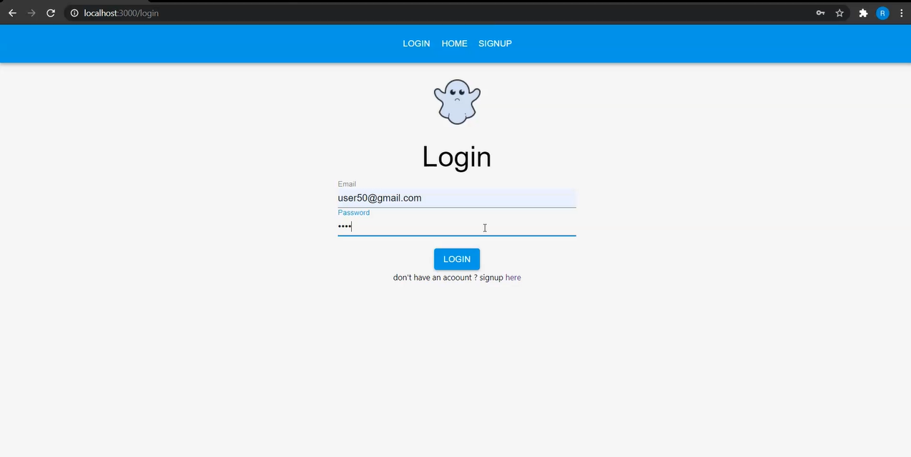
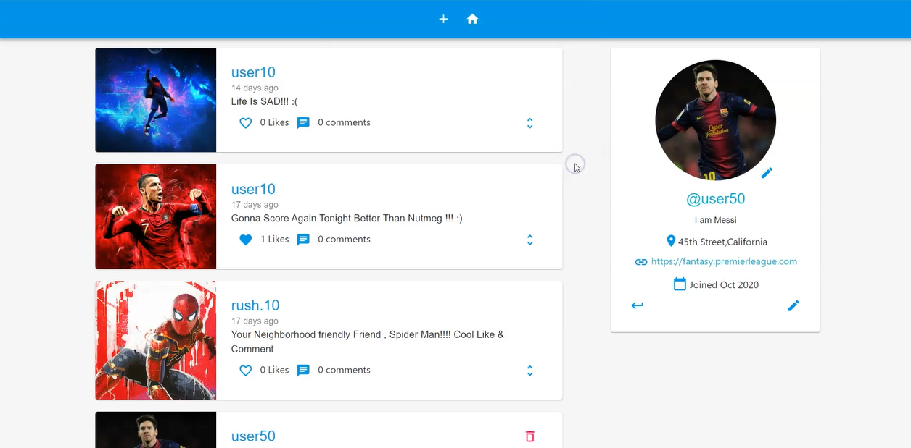
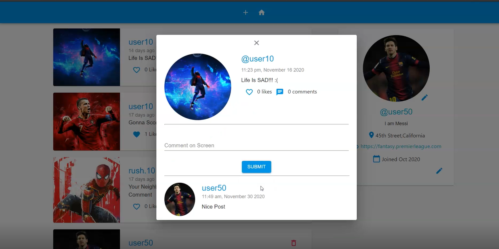
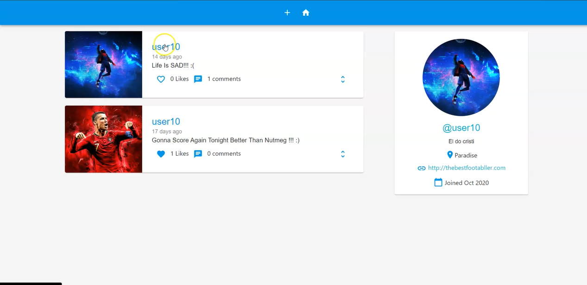
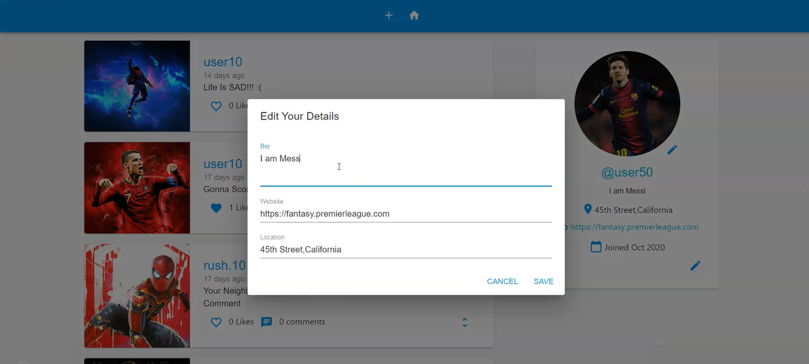
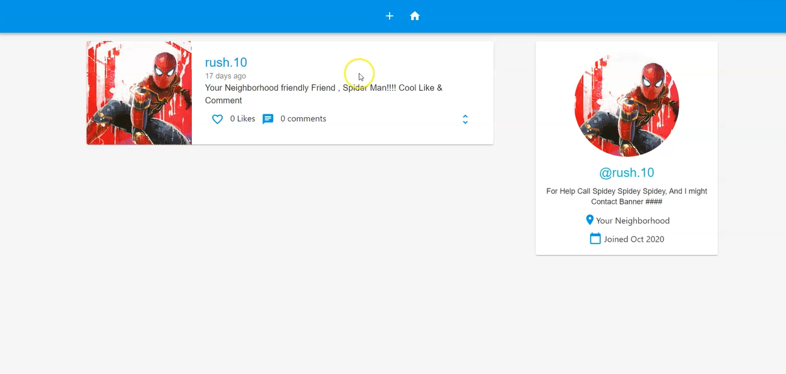
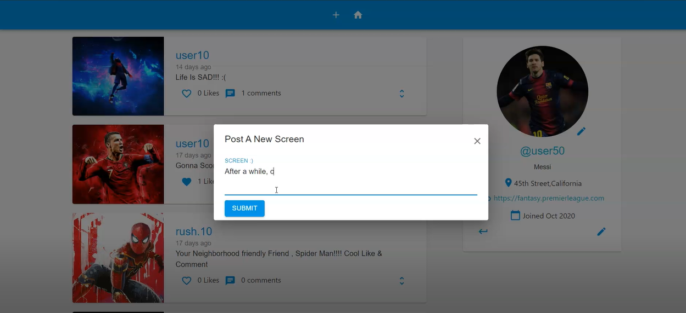
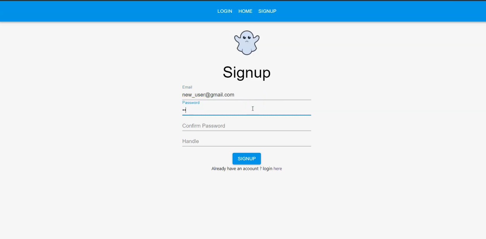

# Twitter Clone FrontEnd

Features :
* Login / Signup
* Add a Tweet 
* Delete a Tweet
* Comment
* Like
* Go To User's Profile
* Edit Bio
* Edit Personal Image

Instructions:
* The backend for this is stored in a different repo Twitter-Clone-Backend
* Backend is done in Firebase functions
* Frontend is done in react
* After starting the server : npm start

